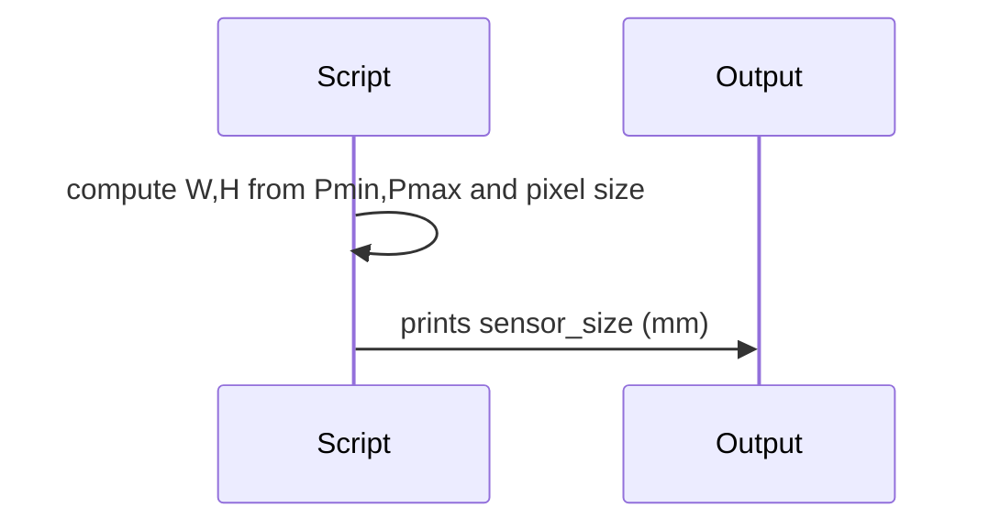

# Basler_sensor_size

## Overview
Small helper script computing nominal Basler sensor size (mm) from documented pixel counts and pixel pitch.

## Physics & Mathematics
Computes sensor dimensions as `W = nx * pixel_size_um`, `H = ny * pixel_size_um` in millimeters. No optics here.

## Logical Flow
- Define pixel min/max ranges and pixel size (µm).  
- Compute width and height in mm.

## Architecture Diagram

## Interface (API)
| Name | Type | Description |
|---|---:|---|
| Script | script | top-of-file constants control output |
| Output `sensor_size` | vector [mm] | computed width and height |
