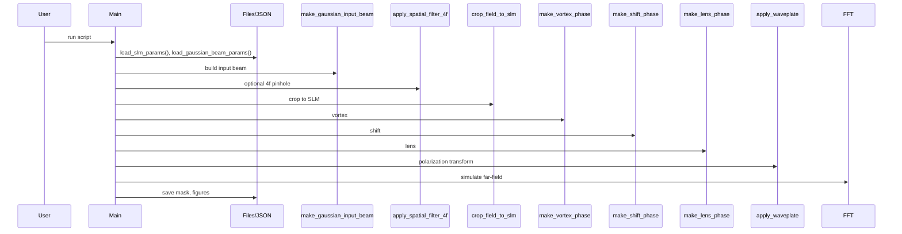

# Main

## Overview
Top-level script demonstrating simulation workflows: build input beam, apply spatial filtering, create SLM masks (vortex, shift, lens), encode phase-only holograms, simulate Fourier-plane, and save outputs.

## Physics & Mathematics
Combines Gaussian beam optics, Fresnel/Fraunhofer transforms and phase holography. Key relations used:
- Steering via carrier frequency: $f_{cp}=\theta\,p/\lambda$ (small-angle).  
- Digital lens phase: $\phi_{lens}=-\pi( X^2+Y^2)/(\lambda f)$.  
- Vortex: $\phi_{vortex}=\ell\,\theta$.  

Fourier-plane mapping (for lens focal length $f$): coordinates in focal plane are
$$X_f=\lambda f f_x,\qquad f_x=\frac{k_x}{2\pi}.$$ 

## Logical Flow
- Load device params `slm`, beam params.  
- Build input beam on expanded coords using `make_gaussian_input_beam`.  
- Optionally apply 4f spatial filtering and crop to `slm` size.  
- Choose steering: angle or shift; compute `fcp` and clamp to Nyquist.  
- Build vortex, shift, and lens masks; combine and create phase-only hologram.  
- Apply waveplate model, map wrapped phase to device units, save images, and optionally simulate far-field via padded FFT.

## Architecture Diagram

## Interface (API)
| Name | Type | Description |
|---|---:|---|
| Script | N/A | Top-level; reads JSONs `LCOS_SLM_X15213.json`, `GaussianBeam.json` |
| Outputs | images, `.bmp`, `.mat` | saved mask and simulation images |
