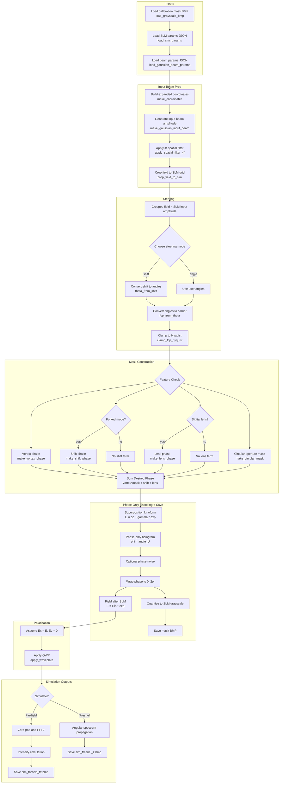

# Donut Simulator: Simulation Flow

This document outlines the execution logic for `donut_simulator.m` and serves as a guideline for Mermaid flowcharts in this repo.

## Flowchart Guidelines (Mermaid)

- Use fenced blocks: ```` ```mermaid ```` … ```` ``` ```` (GitHub renders these automatically).
- Keep node text simple (avoid parentheses-heavy “code-like” labels); put detailed math in the “Key relations” section below in LaTeX.
- Prefer a small number of nodes with clear verbs; use `subgraph` blocks to group major phases.
- When you reference code, use the exact function name (no arguments) and add a traceability list with `donut_simulator.m:<line>` links.

## Process Flowchart (Matches `donut_simulator.m`)



## Traceability (Key Calls in `donut_simulator.m`)

- Calibration mask load: `donut_simulator.m:9`
- Parameter loads: `donut_simulator.m:55`, `donut_simulator.m:63`
- Grid + beam: `donut_simulator.m:84`, `donut_simulator.m:87`
- 4f filter + crop: `donut_simulator.m:96`, `donut_simulator.m:98`
- Steering + clamp: `donut_simulator.m:138`, `donut_simulator.m:153`, `donut_simulator.m:157`, `donut_simulator.m:160`
- Phase construction: `donut_simulator.m:195`, `donut_simulator.m:201`, `donut_simulator.m:205`, `donut_simulator.m:210`
- Kinoform + wrap + field: `donut_simulator.m:221`, `donut_simulator.m:240`, `donut_simulator.m:286`
- Waveplate: `donut_simulator.m:297`
- Save mask: `donut_simulator.m:346`
- Far-field sim + save: `donut_simulator.m:363`, `donut_simulator.m:444`
- Fresnel sim + save: `donut_simulator.m:455`, `donut_simulator.m:473`

Key relations referenced:
- Carrier from angle: $f_{cp,x} = \theta_x p_x / \lambda$, clamp $\lVert f_{cp} \rVert \le 0.5$ cycles/pixel.
- Fourier-plane shift: $\Delta x = f \lambda f_{cp,x} / p_x$ (and $y$ likewise).
- Lens phase: $\phi_{\text{lens}} = -\pi (X^2+Y^2)/(\lambda f_{\text{focus}})$.
- Kinoform: $U = d_c + \gamma e^{i \phi_{\text{des}}}$, $\phi = \arg(U)$, wrap to $[0, 2\pi)$.
