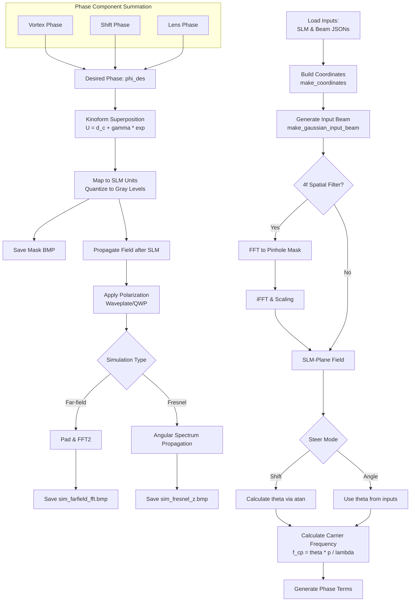

# Donut Simulator: Simulation Flow

This document outlines the execution logic for `donut_simulator.m`. The flowchart below describes the data transformation from input parameters to the final simulated field.

## Process Flowchart

Key relations referenced:
- Carrier from angle: $f_{cp,x} = \theta_x p_x / \lambda$, clamp $\lVert f_{cp} \rVert \le 0.5$ cycles/pixel.
- Fourier-plane shift: $\Delta x = f \lambda f_{cp,x} / p_x$ (and $y$ likewise).
- Lens phase: $\phi_{\text{lens}} = -\pi (X^2+Y^2)/(\lambda f_{\text{focus}})$.
- Kinoform: $U = d_c + \gamma e^{i \phi_{\text{des}}}$, $\phi = \arg(U)$, wrap to $[0, 2\pi)$.
