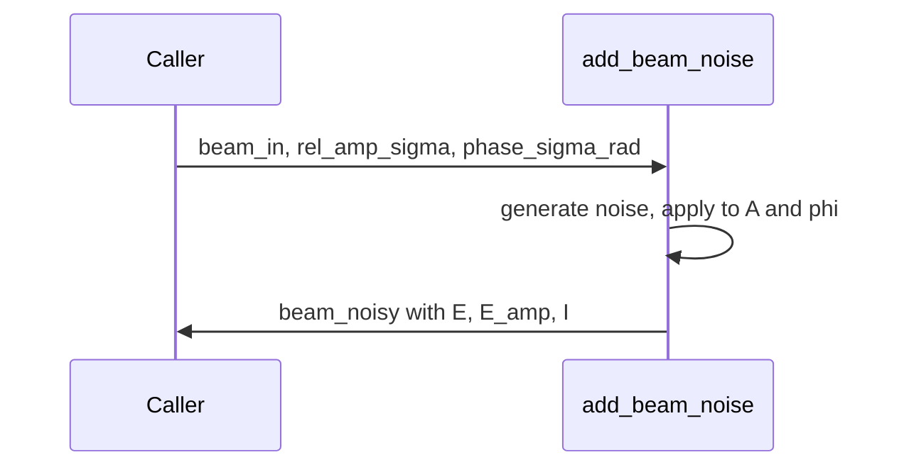

# add_beam_noise

## Overview
Add multiplicative amplitude noise and additive phase noise to a beam struct. Supports input in either `E` (complex field) or `E_amp` (real amplitude).

## Physics & Mathematics
Amplitude noise is multiplicative with relative RMS $\sigma_a$:
$$A_{noisy}=A\cdot(1+n),\quad n\sim\mathcal{N}(0,\sigma_a^2).$$
Phase noise is additive Gaussian with standard deviation $\sigma_\phi$: $\phi_{noisy}=\phi+\delta\phi$, $\delta\phi\sim\mathcal{N}(0,\sigma_\phi^2)$. Reconstructed field:
$$E_{noisy}=A_{noisy}e^{i\phi_{noisy}}.$$ Normalization uses a max-based rescaling of the generated noise to avoid outliers in practice.

## Logical Flow
- Determine whether input contains `E` or `E_amp`.  
- Extract amplitude and phase, generate normalized Gaussian noise arrays, scale by requested sigmas, apply multiplicative/additive noise, clamp negative amplitudes to zero.  
- Reconstruct complex field `E_noisy` and store updated `E`, `E_amp`, `I` in output struct.

## Architecture Diagram

## Interface (API)
| Name | Type | Description |
|---|---:|---|
| `beam_in` | struct | must contain either `.E` or `.E_amp` |
| `rel_amp_sigma` | scalar | relative amplitude RMS (e.g. 0.05) |
| `phase_sigma_rad` | scalar | phase RMS in radians |
| Returns `beam_noisy` | struct | contains `E`, `E_amp`, `I` updated |
