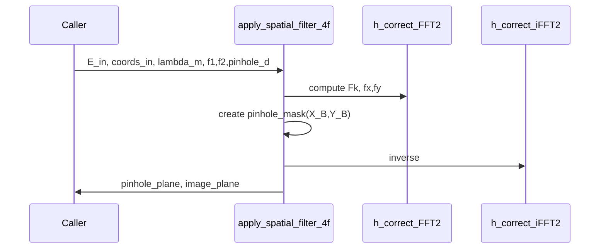

# apply_spatial_filter_4f

## Overview
Implement a 4f spatial filter (lens1 -> pinhole -> lens2) using physically-correct FFT scaling and mapping between spatial-frequency and focal-plane coordinates.

## Physics & Mathematics
Forward FT (object to focal plane) uses convention
$$F(f_x,f_y)=\iint E(x,y)e^{-i2\pi(f_x x+f_y y)}dxdy$$
and the focal-plane coordinates relate as $X_B=\lambda f_1 f_x$. The pinhole mask multiplies spectrum in focal plane. Inverse transform uses corrected iFFT scaling to map back to a spatial domain with magnification $M=f_2/f_1$ and optional inversion.

## Logical Flow
- Validate inputs.  
- Compute corrected FFT via `h_correct_FFT2` to obtain `E_B` and frequency axes.  
- Build pinhole mask in meters and apply.  
- Use `h_correct_iFFT2` to return to spatial domain and scale for magnification `M`.  
- Pack `pinhole_plane` and `image_plane` structs with coordinate metadata.

## Architecture Diagram

## Interface (API)
| Name | Type | Description |
|---|---:|---|
| `E_in` | 2D array | complex field at input plane |
| `coords_in` | struct | must include `X,Y,x_mm,y_mm,px_m,py_m` |
| `lambda_m,f1_m,f2_m,pinhole_d_m` | scalars | optical parameters |
| Returns `pinhole_plane` | struct | focal-plane field before/after pinhole and mask |
| Returns `image_plane` | struct | resulting image-plane field with coords and I |
