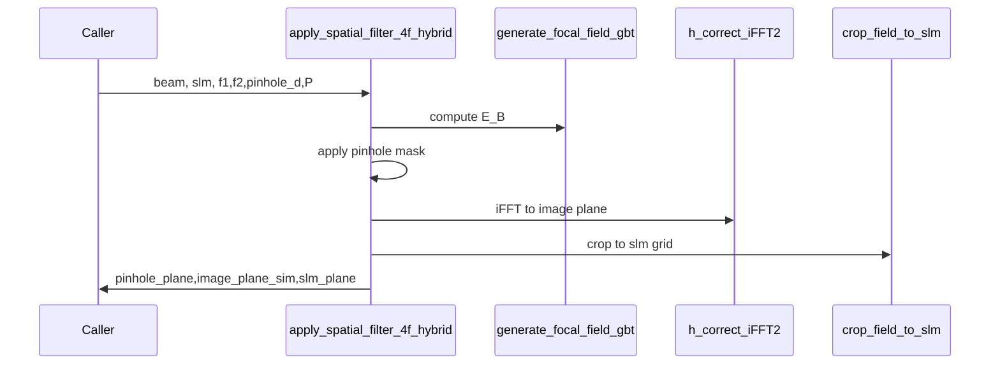

# apply_spatial_filter_4f_hybrid

## Overview
Hybrid 4f simulation combining GBT-based focal-field generation with FFT-based inverse propagation and cropping to SLM coordinates. Produces `pinhole_plane`, `image_plane_sim`, and `slm_plane`.

## Physics & Mathematics
Uses ABCD/q-parameter focal-field generation (see `generate_focal_field_gbt`) to construct a high-resolution focal-plane field $E_B$, applies a pinhole mask (multiplication in the focal plane), then constructs the image plane via corrected iFFT scaling. Spatial-frequency to focal-plane mapping uses $X_B=\lambda f_1 f_x$.

Key relations:
$$E_{B,p}=E_B\cdot M_{pinhole}(X_B,Y_B),\qquad E_C=\mathrm{iFFT}(E_{B,p})\quad\text{(scaled appropriately)}.$$ 

## Logical Flow
- Compute simulation grid sizes and focal-plane spans.  
- Call `generate_focal_field_gbt` to compute $E_B$ and `coords_B`.  
- Build pinhole mask and apply it.  
- Use `h_correct_iFFT2` to obtain correctly scaled image-plane field for `f2`.  
- Crop padded image to SLM grid via `crop_field_to_slm`.

## Architecture Diagram

## Interface (API)
| Name | Type | Description |
|---|---:|---|
| `beam` | struct | beam parameters and fields (beam.lambda_m, w0, Amp, etc.) |
| `slm` | struct | SLM parameters |
| `f1_m,f2_m` | scalar [m] | lens focal lengths |
| `pinhole_d_m` | scalar [m] | pinhole diameter |
| `P` | integer | padding/oversampling factor |
| Returns `pinhole_plane,image_plane_sim,slm_plane` | structs | contain `E`, `I`, `coords`, masks and metadata |
