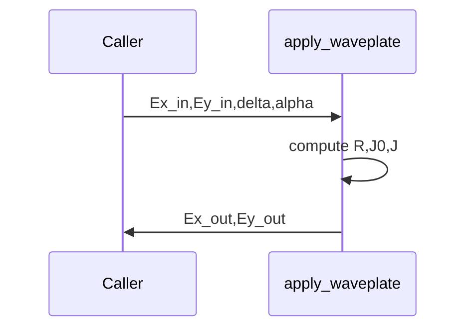

# apply_waveplate

## Overview
Jones-waveplate model: given input Jones vector components `Ex_in, Ey_in`, returns output components after a waveplate with retardance `delta` and fast-axis angle `alpha`.

## Physics & Mathematics
Rotation matrix for angle $\alpha$:
$$R=\begin{pmatrix}\cos\alpha & -\sin\alpha\\ \sin\alpha & \cos\alpha\end{pmatrix}$$
Waveplate Jones matrix in its principal axes:
$$J_0=\begin{pmatrix}1 & 0\\ 0 & e^{i\delta}\end{pmatrix}$$
Total Jones in lab frame:
$$J=R^{T}J_0R$$
Output field is $\mathbf{E}_{out}=J\,\mathbf{E}_{in}$.

## Logical Flow
- Build rotation `R`, build `J0`, compute `J=R' * J0 * R`, apply to input components and return `Ex_out,Ey_out`.

## Architecture Diagram

## Interface (API)
| Name | Type | Description |
|---|---:|---|
| `Ex_in`,`Ey_in` | arrays | input complex field components |
| `delta` | scalar [rad] | retardance (pi/2 is QWP) |
| `alpha` | scalar [rad] | fast-axis angle |
| Returns `Ex_out`,`Ey_out` | arrays | output field components after waveplate |
