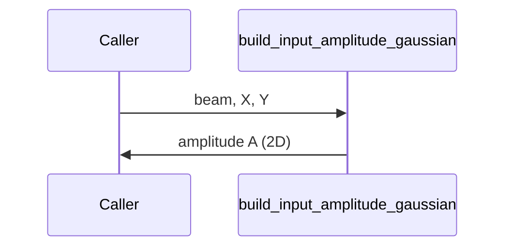

# build_input_amplitude_gaussian

## Overview
Create a collimated Gaussian amplitude on an SLM plane using beam parameters and centering coordinates.

## Physics & Mathematics
For amplitude using 1/e^2 intensity radii $w_x,w_y$ (notation in code uses `w0x_1e2_m`):
$$A(x,y)=P\exp\left(-\frac{(x-x_c)^2}{w_x^2}-\frac{(y-y_c)^2}{w_y^2}\right)$$
where $P$ is a power normalization factor.

## Logical Flow
- Center coordinates by subtracting beam centers.  
- Compute amplitude array using the above formula and return it.

## Architecture Diagram

## Interface (API)
| Name | Type | Description |
|---|---:|---|
| `beam` | struct | contains `w0x_1e2_m,w0y_1e2_m,center_x_m,center_y_m,power_norm` |
| `X`,`Y` | 2D arrays | physical grids [m] |
| Returns `A` | 2D array | amplitude field (real positive) |
