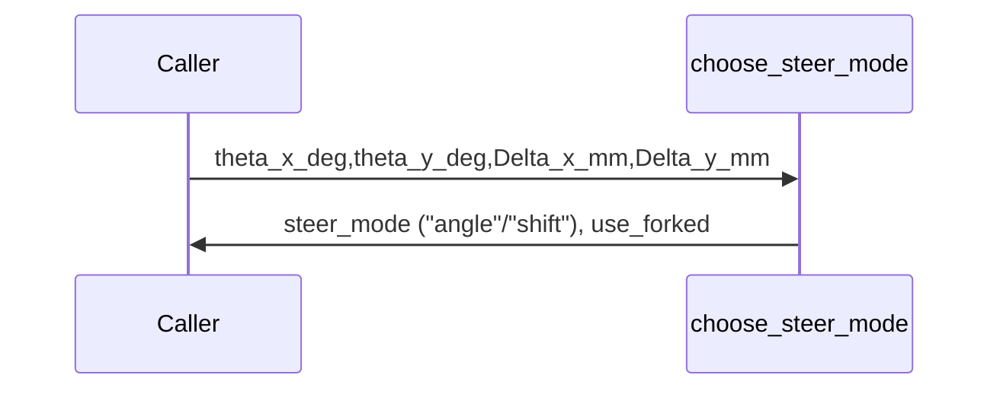

# choose_steer_mode

## Overview
Decide whether user-specified steering is by angle or by Fourier-plane shift; angle input takes precedence.

## Physics & Mathematics
No physics. Simple logical priority rules:
- If any `theta_x_deg` or `theta_y_deg` non-zero, mode=`angle`.  
- Else if any `Delta_x_mm` or `Delta_y_mm` non-zero, mode=`shift`.

## Logical Flow
- Inspect inputs; set `steer_mode` string and `use_forked` flag accordingly. If all zeros, default to angle with tiny value to avoid degenerate case.

## Architecture Diagram

## Interface (API)
| Name | Type | Description |
|---|---:|---|
| `theta_x_deg`,`theta_y_deg` | scalar [deg] | angle inputs |
| `Delta_x_mm`,`Delta_y_mm` | scalar [mm] | shift inputs |
| Returns `steer_mode` | string | `"angle"` or `"shift"` |
| Returns `use_forked` | char/bool | indicator used downstream |
