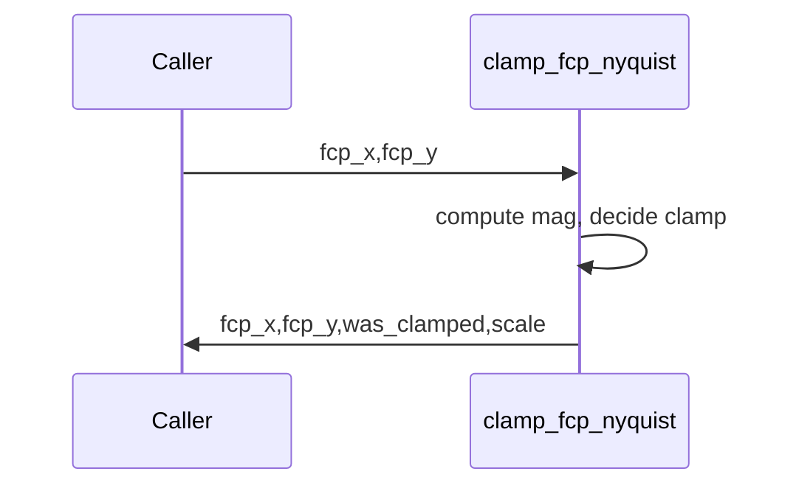

# clamp_fcp_nyquist

## Overview
Enforce Nyquist limit on carrier frequencies: clamp magnitude to at most 0.5 cycles/pixel, returning scale and a flag indicating clamping.

## Physics & Mathematics
Carrier frequency vector magnitude $|f_{cp}|=\sqrt{f_{x}^{2}+f_{y}^{2}}$. Nyquist sampling requires $|f_{cp}|\le 0.5$ (cycles/pixel). When exceeded, scale both components by
$$s=\frac{0.5}{|f_{cp}|}$$
so that scaled vector has magnitude 0.5.

## Logical Flow
- Compute magnitude; if greater than 0.5 compute `scale=0.5/fcp_mag`, multiply `fcp_x,fcp_y` by `scale` and set `was_clamped=true`.  
- Otherwise return inputs unchanged and `was_clamped=false`.

## Architecture Diagram

## Interface (API)
| Name | Type | Description |
|---|---:|---|
| `fcp_x`,`fcp_y` | scalar | carrier cycles/pixel inputs |
| Returns `fcp_x`,`fcp_y` | scalar | possibly scaled frequencies |
| Returns `was_clamped` | logical | true if clamped |
| Returns `scale` | scalar | scaling factor applied (1 if unchanged) |
