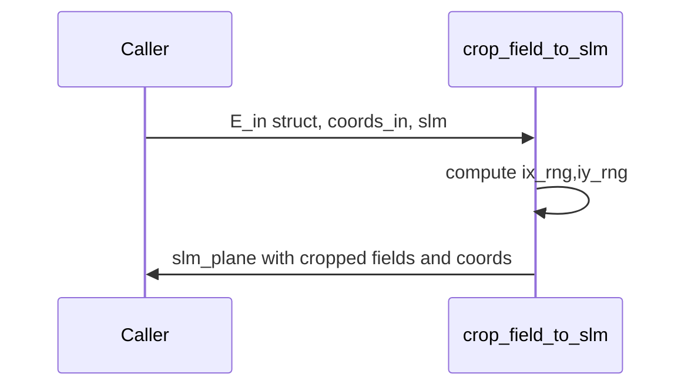

# crop_field_to_slm

## Overview
Two complementary crop utilities exist: one that crops all matching fields in a struct preserving array shapes and metadata, and another that specifically crops a complex field and rebuilds canonical SLM `coords`.

## Physics & Mathematics
No physics; indexing/cropping with careful handling of 2D arrays and higher-dimensional fields. Maintains origin metadata for mapping back to parent plane.

## Logical Flow
- Validate `slm` and `coords_in`.  
- Compute crop indices centered around zero (or reuse `slm.crop_idx`).  
- Crop every numeric field that matches the parent shape, slice vectors matching Nx or Ny, and pack `slm_plane.coords` with sliced `X,Y,x_mm,y_mm`.  
- Store `crop_idx` and center/origin metadata in `slm_plane`.

## Architecture Diagram

## Interface (API)
| Name | Type | Description |
|---|---:|---|
| `E_in` | struct | contains arrays keyed by field names (E,I,...) |
| `coords_in` | struct | parent plane coordinates with `x_mm,y_mm` |
| `slm` | struct | must include `Nx,Ny` and optional `crop_idx` |
| Returns `slm_plane` | struct | cropped fields, `coords`, `crop_idx`, `center_in_parent_mm` |
