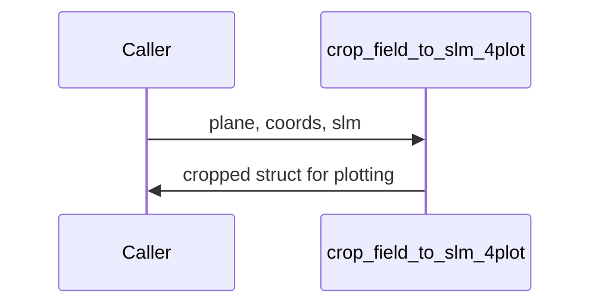

# crop_field_to_slm_4plot

## Overview
Helper used to crop planes for plotting (Ny x Nx preview) keeping visual fidelity for display; preserves plotting-friendly downsampled or block-averaged fields.

## Physics & Mathematics
No physics: indexing and slicing operations to extract a centered subarray of an existing field for display while preserving aspect ratio.

## Logical Flow
- Accept plane struct and target SLM geometry.  
- Compute crop indices centered at 0 and slice arrays that match parent sizes.  
- Return a smaller struct appropriate for plotting with `coords` having `x_mm,y_mm` matching the cropped region.

## Architecture Diagram

## Interface (API)
| Name | Type | Description |
|---|---:|---|
| `E_in` | struct | input plane fields (may include E,I,fx,fy,...) |
| `coords_in` | struct | parent coordinates with `x_mm,y_mm` |
| `slm` | struct | SLM Nx,Ny used to select crop size |
| Returns `slm_plane` | struct | cropped plane for plotting (coords, I, E_preview, etc.) |
