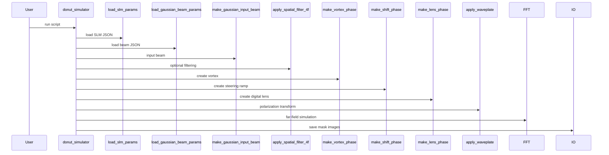

# donut_simulator

## Overview
High-level script to build SLM phase masks (vortex, forked/steered, digital lens), encode phase-only kinoforms, apply polarization model and simulate far-field and Fresnel propagation. Saves masks and diagnostic images.

## Physics & Mathematics
Combines vortex phase $\ell\theta$, linear grating phase for steering, and quadratic Fresnel lens phase. Phase-only hologram formed from complex field
$$U=d_c+\gamma e^{i\phi_{combined}},\qquad\phi=\operatorname{angle}(U).$$
Far-field of SLM pattern computed via padded FFT; mapping from FFT bins to focal-plane distances uses $x_F=\lambda f f_x$.

## Logical Flow
- Load calibration and device JSONs.  
- Build input Gaussian beam and (optionally) 4f spatial filtering.  
- Determine steering mode, compute `fcp` and clamp to Nyquist.  
- Build phase masks (`vortex`, `shift`, `lens`) and combine.  
- Encode phase-only hologram with DC bias and weights, optionally add phase noise, wrap to [0,2π) and map to device units.  
- Apply waveplate Jones matrix, compute far-field via padded FFT or Fresnel propagation and save images.

## Architecture Diagram

## Interface (API)
| Name | Type | Description |
|---|---:|---|
| Script | script | top-level driver reading JSONs and saving outputs |
| Outputs | files | SLM mask bitmap, FFT images, optional Fresnel images |
