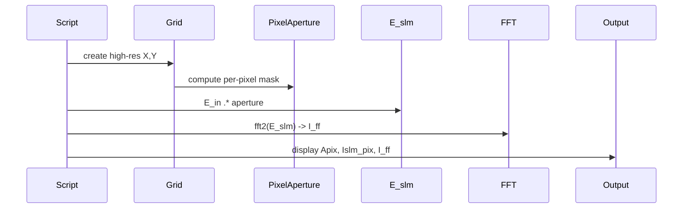

# donut_vortex_with_pixel_MTF

## Overview
Script demonstrating simulation of a vortex (donut) beam considering finite pixel aperture (pixel MTF) and sampling effects. Produces high-resolution simulation, pixel-block averages and far-field results.

## Physics & Mathematics
Models SLM aperture as an array of rectangular pixel apertures of width $p\cdot\mathrm{fill}$ and computes far-field (Fraunhofer) diffraction via FFT. Continuous FT scaling uses the Riemann-sum convention
$$U(f_x,f_y)=\iint E(x,y)e^{-i2\pi(f_x x+f_y y)}\,dxdy$$
and discrete implementation multiplies by sample area $(\Delta x\Delta y)$ after the FFT. Pixel aperture modulation acts as a multiplication in object plane, producing convolution in frequency domain (pixel MTF envelope).

## Logical Flow
- Build high-resolution grid (oversampling OS).  
- Create periodic per-pixel aperture using modulo coordinates and fill factor.  
- Multiply incident Gaussian by aperture, compute padded FFT and normalized intensity, map to spatial frequencies and angles, optionally map to focal-plane coordinates using $X_f=\lambda f f_x$.

## Architecture Diagram

## Interface (API)
| Name | Type | Description |
|---|---:|---|
| Script | script | reads parameters at top (lambda,p,fill,Nx,Ny,OS,...) |
| Outputs | images | pixel aperture, SLM field, far-field intensity (log) |
