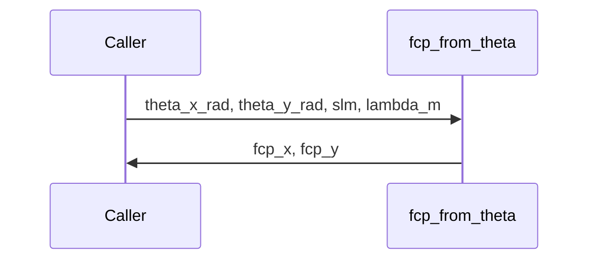

# fcp_from_theta

## Overview
Convert steering angles (radians) to carrier frequencies in cycles-per-pixel consistent with sampled SLM phase ramps.

## Physics & Mathematics
Small-angle model maps steering angle $\theta$ to carrier cycles-per-pixel using pixel pitch $p$ and wavelength $\lambda$:
$$f_{cp}=\frac{\theta\,p}{\lambda}.$$ 
This formula assumes the SLM phase ramp sampled at pitch $p$ produces the required angular deflection in the far field.

## Logical Flow
- Validate wavelength and SLM pixel side fields.  
- Compute `fcp_x = theta_x_rad * slm.px_side_m / lambda_m` and similarly for `y`.

## Architecture Diagram

## Interface (API)
| Name | Type | Description |
|---|---:|---|
| `theta_x_rad`,`theta_y_rad` | scalar [rad] | steering angles |
| `slm` | struct | must contain `px_side_m`,`py_side_m` |
| `lambda_m` | scalar [m] | wavelength |
| Returns `fcp_x`,`fcp_y` | scalar [cycles/pixel] | carrier frequencies |
