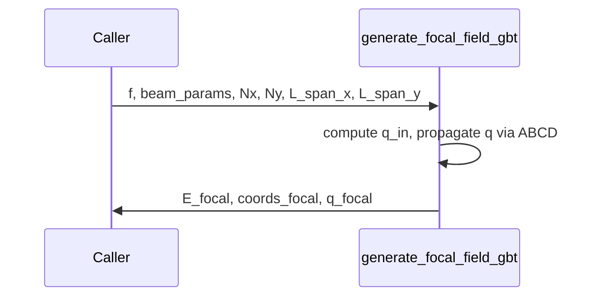

# generate_focal_field_gbt

## Overview
Generate the electric field in a lens focal plane for a Gaussian beam using ABCD/q-parameter formalism and explicit extraction of focal-plane waist and curvature to avoid central dark spots.

## Physics & Mathematics
Use complex beam parameter $q$ and ABCD propagation. For a Gaussian beam,
$$\frac{1}{q(z)}=\frac{1}{R(z)}-i\frac{\lambda}{\pi w(z)^2}.$$ 
Under an ABCD system,
$$q_{out}=\frac{A q_{in}+B}{C q_{in}+D}.$$ 
At output, beam waist is related to $\mathrm{Im}(1/q)$ by
$$w=\sqrt{\frac{\lambda}{\pi|\text{Im}(1/q)|}}$$
and curvature $R=1/\text{Re}(1/q)$ when defined.

## Logical Flow
- Extract beam waist and waist position, compute input $q$ for x & y using $M^{2}$ corrections.  
- Apply ABCD matrix for lens propagation to focal plane.  
- Compute output $w_{focal}$ and $R_{focal}$ from $1/q$.  
- Build separable field components and combine to form full 2D focal field `E_focal`.  

## Architecture Diagram

## Interface (API)
| Name | Type | Description |
|---|---:|---|
| `f` | scalar [m] | focal length used in ABCD propagation |
| `beam_params` | struct | must include `lambda_m`, `w_0x_m`, `w_0y_m`, `z_0x_m`, `z_0y_m`, `M2x`, `M2y`, `Amp` |
| `Nx,Ny` | integers | grid sampling in focal plane |
| `L_span_x_m,L_span_y_m` | scalar [m] | physical lateral spans to simulate |
| Returns `E_focal` | complex array | 2D focal-plane field |
| Returns `coords_focal` | struct | focal-plane coords (X,Y,x_mm,y_mm,px_m,py_m) |
| Returns `q_focal` | struct | complex q-parameters for x and y |
