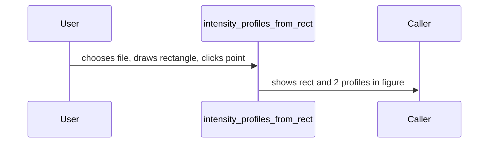

# intensity_profiles_from_rect

## Overview
Interactive utility: load an image, select a rectangle and a point inside it, then compute and plot intensity profiles along X and Y through that point within the rectangle.

## Physics & Mathematics
No deep physics. Profiles are pixel intensity cross-sections. Coordinates are shifted so the selected point is the origin; signals are displayed versus pixel offset.

## Logical Flow
- Prompt user to select image file.  
- Convert to grayscale if needed.  
- User draws rectangle and selects a point.  
- Extract row and column profiles constrained to the rectangle; plot rectangle preview and profile plots.

## Architecture Diagram

## Interface (API)
| Name | Type | Description |
|---|---:|---|
| Interactive | GUI | Uses `uigetfile`, `imrect`, `ginput` to obtain inputs |
| Outputs | plots | rectangle area and X/Y intensity profiles |
