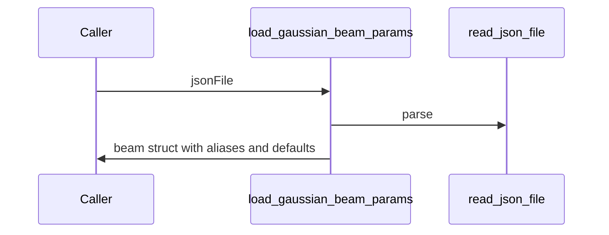

# load_gaussian_beam_params

## Overview
Load Gaussian beam parameters from JSON and provide backward-compatible aliases used by GBT (GBT-friendly names like `w_0x_m`, `M2x`, etc.). Ensures sensible defaults for optional fields.

## Physics & Mathematics
Maps legacy beam parameters into consistent symbols used by beam propagation. Key relations:
$$z_R=\frac{\pi w_0^2}{M^2\lambda},\quad w(z)=w_0\sqrt{1+(z/z_R)^2}.$$

## Logical Flow
- Read JSON via `read_json_file`.  
- Validate required fields and positive numerics.  
- Populate defaults (`M2=1`, `waist_z_m=0`, `Amp=power_norm`).  
- Add aliases: `w_0x_m`,`w_0y_m`,`M2x`,`M2y`,`z_0x_m`,`z_0y_m`.

## Architecture Diagram

## Interface (API)
| Name | Type | Description |
|---|---:|---|
| `jsonFile` | string | path to GaussianBeam.json |
| Returns `beam` | struct | includes `lambda_m,w0x_1e2_m,w0y_1e2_m,center_x_m,center_y_m,M2,waist_z_m,Amp` and GBT aliases |
