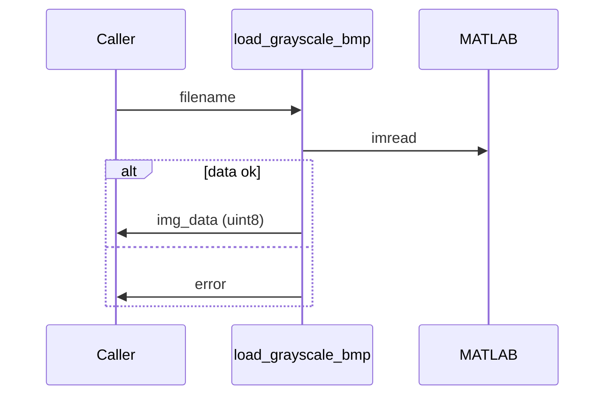

# load_grayscale_bmp

## Overview
Loads an 8-bit grayscale BMP image and validates it is single-channel `uint8`. Throws descriptive errors for RGB or other formats.

## Physics & Mathematics
No physics. Validates datatype and dimensions: expects array type `uint8` and 2D shape (M x N).

## Logical Flow
- Attempt `imread`.  
- Check class equals `uint8`.  
- Ensure image is 2D (not RGB or higher dims).  
- Return the image data as `uint8`.

## Architecture Diagram

## Interface (API)
| Name | Type | Description |
|---|---:|---|
| `filename` | string | path to image |
| Returns `img_data` | uint8 2D array | grayscale image data |
