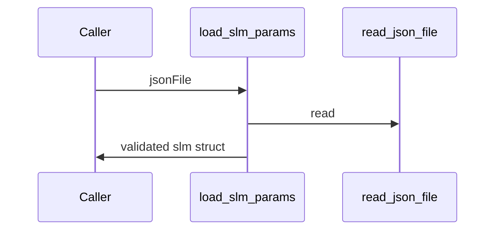

# load_slm_params

## Overview
Load and validate SLM parameters from JSON; casts numeric fields and enforces ranges (fill factor, c2pi2unit, etc.).

## Physics & Mathematics
No physics; validation ensures numeric correctness for parameters used in later optics code. Example checks include
$$0<\text{Fill\_factor\_percent}\le 100,\qquad 1\le\text{c2pi2unit}\le 255.$$ 

## Logical Flow
- Read JSON via `read_json_file`.  
- Ensure required fields exist and are positive.  
- Validate ranges and cast numeric fields to `double`.  

## Architecture Diagram

## Interface (API)
| Name | Type | Description |
|---|---:|---|
| `jsonFile` | string | path to SLM JSON |
| Returns `slm` | struct | validated SLM parameters (Nx,Ny,px_side_m,py_side_m,... ) |
