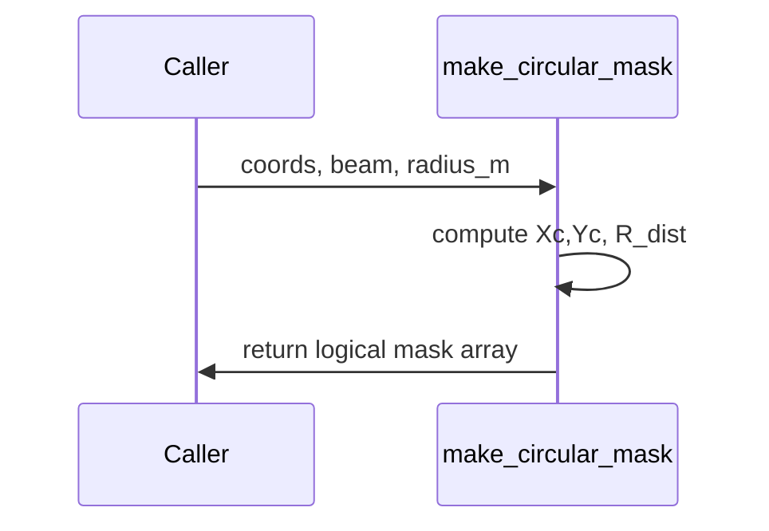

# make_circular_mask

## Overview
Create a logical circular aperture mask centered on `beam.center_x_m, beam.center_y_m` with radius in meters.

## Physics & Mathematics
Radial distance from center
$$R(x,y)=\sqrt{(X-c_x)^2+(Y-c_y)^2},$$
mask is defined as $\mathbf{1}_{R\le r}$.

## Logical Flow
- Validate inputs and required beam center fields.  
- Compute centered coordinates, radial distance `R_dist`, and return `mask = (R_dist <= radius_m)`.

## Architecture Diagram

## Interface (API)
| Name | Type | Description |
|---|---:|---|
| `coords` | struct | must contain `X`,`Y` grids |
| `beam` | struct | must contain `center_x_m`,`center_y_m` |
| `radius_m` | scalar [m] | aperture radius |
| Returns `mask` | logical array | true inside circle |
