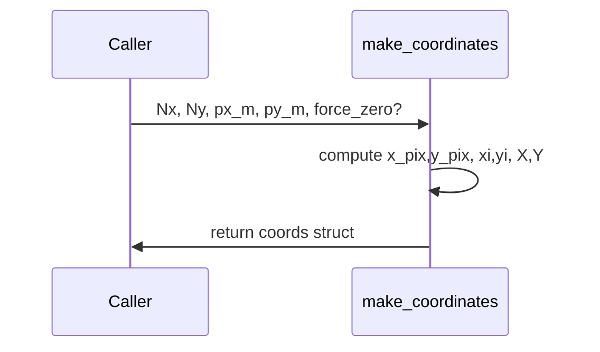

# make_coordinates

## Overview
Construct pixel index grids and physical coordinate grids for a rectangular sampling window. Supports both symmetric (origin between pixels) and `pixel-at-zero` conventions.

## Physics & Mathematics
Index vectors are formed depending on `force_zero` flag. Physical axes are
$$x_{m}=x_{pix}\,p_x,\quad y_{m}=y_{pix}\,p_y$$
and 2D grids are $X=\mathrm{xi}\cdot p_x$, $Y=\mathrm{yi}\cdot p_y$. Angles are computed via $\theta=\text{atan2}(Y,X)$. 

## Logical Flow
- Validate scalars `Nx,Ny,px_m,py_m`.  
- Build `x_pix,y_pix` using `force_zero` or symmetric convention.  
- Build `xi,yi` meshgrids, physical axes `x_m,y_m`, physical grids `X,Y`.  
- Compute helper fields `theta_px,theta,x_mm,y_mm`, set `center_mode`.

## Architecture Diagram

## Interface (API)
| Name | Type | Description |
|---|---:|---|
| `Nx`,`Ny` | integers | grid sizes |
| `px_m`,`py_m` | scalar [m] | sampling pitches |
| `force_zero` | logical (optional) | choose pixel-at-zero convention |
| Returns `coords` | struct | includes `xi,yi,X,Y,x_m,y_m,x_mm,y_mm,theta,theta_px,center_mode` |
