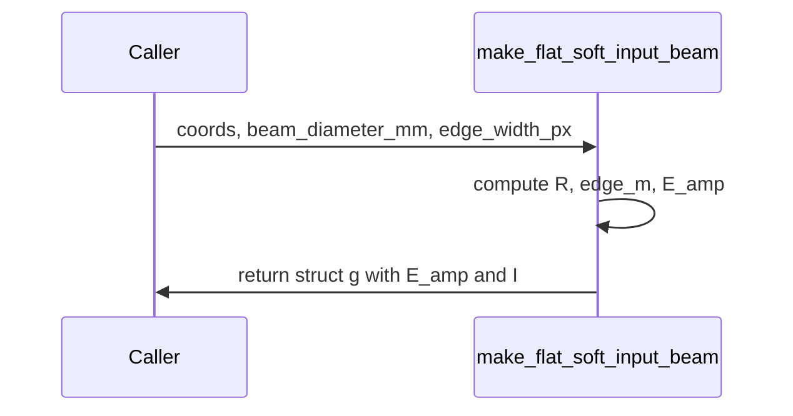

# make_flat_soft_input_beam

## Overview
Create a circular flat-top amplitude mask with soft edges using a tanh profile; outputs amplitude and intensity on a physical grid.

## Physics & Mathematics
Soft circular aperture with physical radius $R$ and soft edge width $\delta$ (in meters). The amplitude profile is implemented as
$$E(r)=\tfrac{1}{2}\left[1-\tanh\left(\frac{r-R}{\delta}\right)\right],\qquad r=\sqrt{X^{2}+Y^{2}}.$$ 
Intensity $I=|E|^{2}$.

## Logical Flow
- Validate `coords` include `X,Y,px_m,py_m`.  
- Convert `beam_diameter_mm` to radius in meters.  
- Convert `edge_width_px` to meters via average pitch.  
- Compute radial distance and apply tanh soft-edge formula to produce `E_amp` and `I`.

## Architecture Diagram

## Interface (API)
| Name | Type | Description |
|---|---:|---|
| `coords` | struct | must contain `X,Y,px_m,py_m` |
| `beam_diameter_mm` | scalar | diameter in mm |
| `edge_width_px` | scalar (optional) | soft edge in samples (default 5) |
| Returns `g` | struct | `E_amp`, `I` (arrays) |
