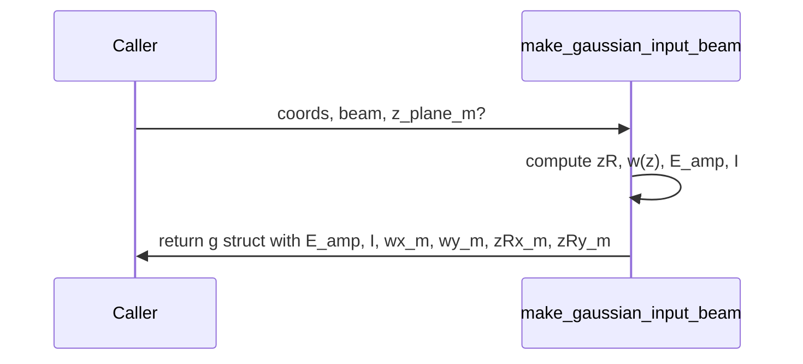

# make_gaussian_input_beam

## Overview
Compute Gaussian electric field amplitude and intensity on a physical grid using an $M^{2}$ model. Returns amplitude `E_amp`, intensity `I`, beam radii `w_x,w_y`, and Rayleigh ranges.

## Physics & Mathematics
Using Gaussian beam propagation with $M^{2}$, Rayleigh range is
$$z_R=\frac{\pi w_0^{2}}{M^{2}\lambda}.$$ The beam radius at axial distance $z$ from the waist is
$$w(z)=w_0\sqrt{1+\left(\frac{z}{z_R}\right)^{2}}.$$ 
The amplitude model (for 1/e^2 intensity radius convention) uses
$$E(x,y;z)=A\exp\left(-\frac{(x-x_c)^{2}}{w_x^{2}(z)}-\frac{(y-y_c)^{2}}{w_y^{2}(z)}\right),$$
and intensity $I=|E|^{2}$.

## Logical Flow
- Validate `coords.X,Y` present and beam struct fields.  
- Fill defaults for `M2,waist_z_m,power_norm`.  
- Compute $zR_x,zR_y$, radii $w_x,w_y$ at requested `z_plane_m`.  
- Center coordinates and build amplitude and intensity arrays; pack into struct `g`.

## Architecture Diagram

## Interface (API)
| Name | Type | Description |
|---|---:|---|
| `coords` | struct | must contain `X,Y` (meters) |
| `beam` | struct | required fields: `beam_type='gaussian', lambda_m, w0x_1e2_m, w0y_1e2_m, center_x_m, center_y_m` |
| `z_plane_m` | scalar (optional) | axial plane location (default 0) |
| Returns `g` | struct | contains `E_amp`, `I`, `wx_m`, `wy_m`, `zRx_m`, `zRy_m` |
