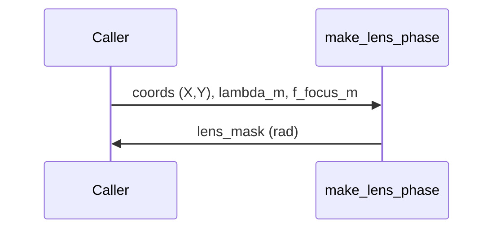

# make_lens_phase

## Overview
Create a quadratic Fresnel lens phase term for digital focusing: common form
$$\phi_{lens}(x,y)=-\frac{\pi}{\lambda f}(X^{2}+Y^{2}).$$

## Physics & Mathematics
Fresnel (paraxial) thin-lens phase at a plane is
$$\phi_{lens}(X,Y)=-\frac{\pi}{\lambda f}\,(X^{2}+Y^{2}),$$
where $X,Y$ are physical coordinates in meters, $\lambda$ the wavelength and $f$ the focal length. The code returns a negative sign consistent with downstream conventions.

## Logical Flow
- Validate `coords` contain `X,Y` and positive `lambda_m,f_focus_m`.  
- Compute phase as above and return.

## Architecture Diagram

## Interface (API)
| Name | Type | Description |
|---|---:|---|
| `coords` | struct | must contain `X`,`Y` (meters) |
| `lambda_m` | scalar [m] | wavelength |
| `f_focus_m` | scalar [m] | focal length |
| Returns `lens_mask` | 2D array [rad] | quadratic lens phase |
