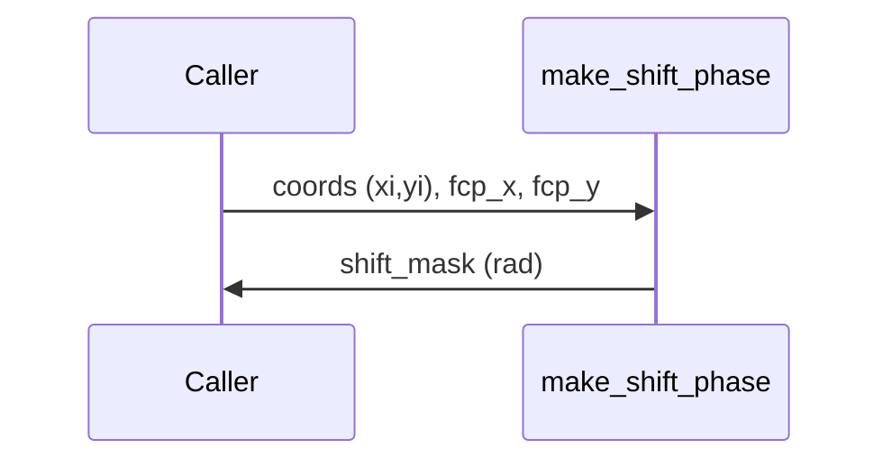

# make_shift_phase

## Overview
Construct a linear phase ramp (grating) to steer the beam by implementing
$$\phi_{shift}(n_x,n_y)=2\pi\,(f_{cp,x} n_x + f_{cp,y} n_y)$$
where $(n_x,n_y)$ are pixel indices.

## Physics & Mathematics
Carrier frequencies in cycles-per-pixel are converted to a phase ramp sampled at pixel indices. For indices $n_x,n_y$:
$$\phi_{shift}(n_x,n_y)=2\pi\left(f_{cp,x}n_x+f_{cp,y}n_y\right).$$

## Logical Flow
- Validate presence of `coords.xi, coords.yi`.  
- Compute `shift_mask = 2*pi*(fcp_x*xi + fcp_y*yi)` and return.

## Architecture Diagram

## Interface (API)
| Name | Type | Description |
|---|---:|---|
| `coords` | struct | must include `xi`,`yi` index grids |
| `fcp_x`,`fcp_y` | scalar [cycles/pixel] | carrier frequencies |
| Returns `shift_mask` | 2D array [rad] | phase ramp map |
