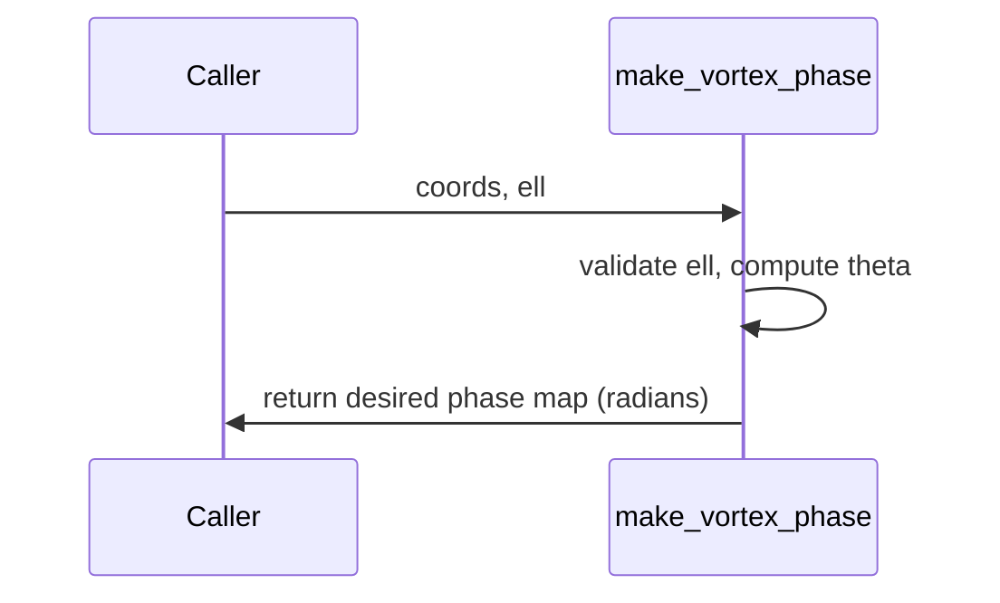

# make_vortex_phase

## Overview
Generate a vortex (spiral) phase map equal to $\ell\,\theta(x,y)$ where $\theta=\text{atan2}(y,x)$ and $\ell$ is the topological charge.

## Physics & Mathematics
The phase of an optical vortex of integer charge $\ell$ is
$$\phi_{vortex}(x,y)=\ell\,\theta(x,y)=\ell\,\text{atan2}(y,x).$$
This produces an azimuthal phase winding of $2\pi\ell$ around the origin, producing orbital angular momentum in the beam.

## Logical Flow
- Validate `ell` is positive integer.  
- Use `coords.X, coords.Y` if present; otherwise fallback to `coords.xi, coords.yi`.  
- Compute `theta = atan2(Y,X)` and return `desired = ell*theta`.

## Architecture Diagram

## Interface (API)
| Name | Type | Description |
|---|---:|---|
| `coords` | struct | must contain `X,Y` (m) or `xi,yi` (indices) |
| `ell` | integer | topological charge |
| Returns `desired` | 2D array [rad] | phase map (radians) |
