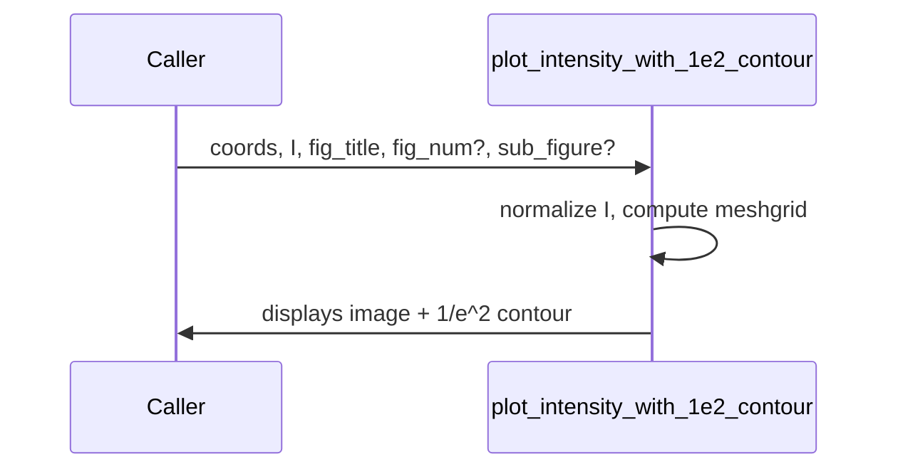

# plot_intensity_with_1e2_contour

## Overview
Displays a normalized intensity map and overlays the $1/e^{2}$ contour in white. Supports optional subplot indexing when `sub_figure` is provided.

## Physics & Mathematics
Normalized intensity is
$$I_{norm}(x,y) = \frac{I(x,y)}{\max I},\qquad I_{target}=e^{-2}.$$
Contour is computed at level $I_{target}$ and drawn over the image.

## Logical Flow
- Validate `coords`.  
- Normalize `I`.  
- Build meshgrid `(Xmm,Ymm)` from `coords.x_mm`,`coords.y_mm`.  
- Plot `imagesc` with axes in mm.  
- Overlay `contour(...,[I_target I_target])` in white.

## Architecture Diagram

## Interface (API)
| Name | Type | Description |
|---|---:|---|
| `coords` | struct | must contain `x_mm`, `y_mm` |
| `I` | 2D array | intensity map |
| `fig_title` | string (optional) | figure title (LaTeX friendly) |
| `fig_num`, `sub_figure` | optional | controls subplot behavior |
| Returns `sub_figure` | struct (optional) | updated subplot bookkeeping |
