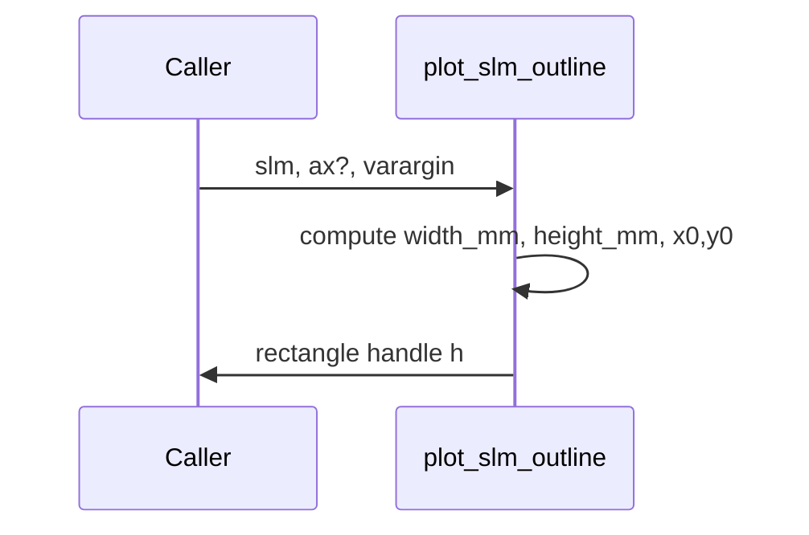

# plot_slm_outline

## Overview
Draws a centered rectangle showing the SLM active area in millimeters on a provided axes. Uses `slm.Nx, slm.Ny, slm.px_side_m, slm.py_side_m`.

## Physics & Mathematics
Computes physical width and height from pixel counts and pixel side lengths:
$$W = N_x p_x,\quad H = N_y p_y$$
Positions rectangle centered at $(0,0)$ with corner at $(-W/2,-H/2)$.

## Logical Flow
- Validate required fields in `slm`.  
- Compute `width_mm = Nx*px_side_m*1e3`, `height_mm = Ny*py_side_m*1e3`.  
- Draw centered rectangle with optional styling args; return handle.

## Architecture Diagram

## Interface (API)
| Name | Type | Description |
|---|---:|---|
| `slm` | struct | must include `Nx, Ny, px_side_m, py_side_m` |
| `ax` | axis handle (optional) | axes to draw into |
| `varargin` | name/value pairs | rectangle drawing options forwarded to `rectangle` |
| Returns `h` | graphics handle | handle to rectangle object |
