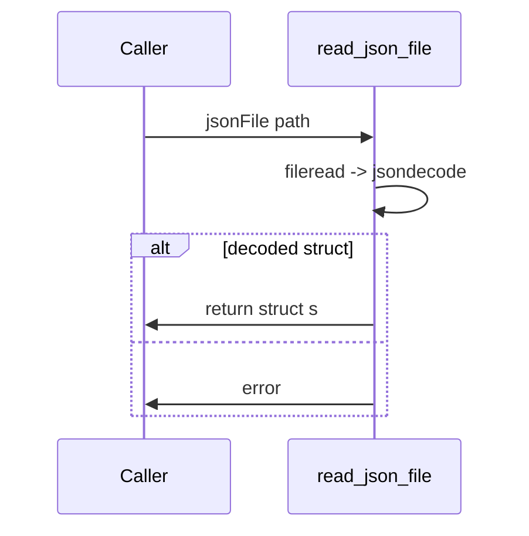

# read_json_file

## Overview
Loads a JSON file from disk and decodes it to a MATLAB struct using `jsondecode`, with basic existence and type checks.

## Physics & Mathematics
No physics. Behavior: read full file text `raw = fileread(jsonFile)` and parse `s = jsondecode(raw)`; assert `isstruct(s)`.

## Logical Flow
- Check file exists, read file contents.  
- Decode JSON to MATLAB data structure.  
- Ensure root is a struct; otherwise error.

## Architecture Diagram

## Interface (API)
| Name | Type | Description |
|---|---:|---|
| `jsonFile` | string | path to JSON file |
| Returns `s` | struct | decoded JSON root
