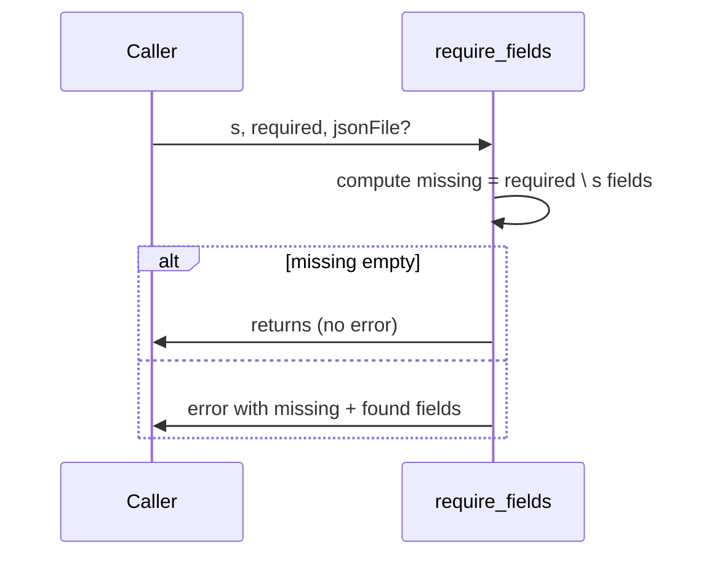

# require_fields

## Overview
Utility that checks a struct contains required field names and throws a helpful error listing missing fields. Used to validate JSON-loaded parameter structs.

## Physics & Mathematics
No physics; simple set membership test. Let the struct field set be $F$ and required list $R$. Missing fields are
$$M = R\setminus F.$$ The function errors if $M\neq\emptyset$.

## Logical Flow
- Accept `s` (struct), `required` (cell array of strings), optional `jsonFile` for error context.  
- Iterate `required`, collect missing names.  
- If any missing, throw an error showing `missing` and `found` fields plus `jsonFile`.

## Architecture Diagram

## Interface (API)
| Name | Type | Description |
|---|---:|---|
| `s` | struct | struct to validate |
| `required` | cell array | list of required field names |
| `jsonFile` | string (optional) | used in error message |
