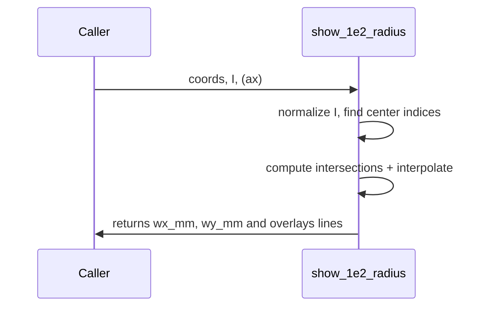

# show_1e2_radius

## Overview
Compute and overlay the 1/e^2 beam radii along principal axes from an intensity map. Produces `w_x` and `w_y` in mm and plots dashed lines on an axis.

## Physics & Mathematics
Normalized intensity $I(x,y)$ is scaled so $\max I=1$. The 1/e^2 level is
$$I_{target}=e^{-2}.$$ 
Radii along axes are found by locating positions where $I(x)=I_{target}$ on central cross-sections and using linear interpolation between samples to estimate $x$ or $y$ at the target.

## Logical Flow
- Validate `coords` and `I` shape.  
- Normalize `I` by its maximum.  
- Extract central horizontal and vertical cross-sections.  
- Find left/right and up/down crossings of $e^{-2}$, interpolate to sub-sample positions, compute mean absolute radii.  
- Plot dashed white lines at ±`w_x`, ±`w_y` on provided axis.

## Architecture Diagram

## Interface (API)
| Name | Type | Description |
|---|---:|---|
| `coords` | struct | must include `x_mm` (1xNx) and `y_mm` (Nyx1) |
| `I` | NyxNx array | intensity map |
| `ax` | axis handle (optional) | axis to plot into |
| Returns `wx_mm`,`wy_mm` | scalar [mm] | 1/e^2 radii along x and y |
