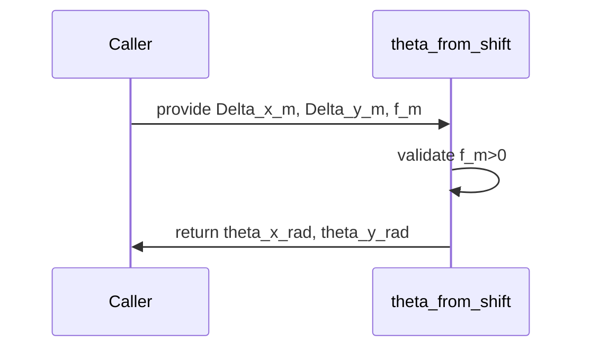

# theta_from_shift

## Overview
Convert a desired Fourier-plane shift (meters) to steering angles (radians) using geometric arctangent. Small, exact helper used by steering logic.

## Physics & Mathematics
Given a lateral shift $\Delta$ in the Fourier/focal plane at focal length $f$, the steering angle $\theta$ follows the exact geometry:
$$\theta = \arctan\left(\frac{\Delta}{f}\right).$$
For small angles $\Delta\ll f$, the small-angle approximation $\theta\approx\Delta/f$ holds.

## Logical Flow
- Validate focal length $f>0$.  
- Compute `theta_x_rad = atan(Delta_x_m / f_m)` and similarly for `y`.
- Return angles in radians.

## Architecture Diagram

## Interface (API)
| Name | Type | Description |
|---|---:|---|
| `Delta_x_m`,`Delta_y_m` | scalar [m] | Desired shift at Fourier plane |
| `f_m` | scalar [m] | Focal length |
| Returns `theta_x_rad`,`theta_y_rad` | scalar [rad] | Steering angles |
